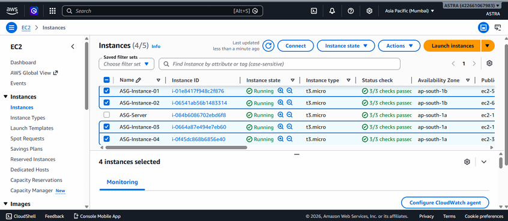

# 🚀 AWS Auto Scaling with Application Load Balancer


A hands-on AWS project demonstrating how to build a scalable, highly available, and fault-tolerant web application using Amazon EC2, an Application Load Balancer (ALB), and an Auto Scaling Group (ASG).


## 📖 Project Overview

This project showcases the implementation of AWS Auto Scaling with an Application Load Balancer to ensure high availability and improved application performance. Incoming traffic is automatically distributed across multiple EC2 instances, while the Auto Scaling Group dynamically launches or terminates instances based on CPU utilization.

The project also includes load testing to verify automatic scaling and self-healing capabilities.


## 🏗️ Architecture

```text
                    Internet
                        │
                        ▼
          ┌─────────────────────────┐
          │ Application Load Balancer│
          └─────────────┬───────────┘
                        │
        ┌───────────────┴───────────────┐
        ▼                               ▼
 ┌─────────────┐                 ┌─────────────┐
 │ EC2 Instance│                 │ EC2 Instance│
 └─────────────┘                 └─────────────┘
           ▲                           ▲
           └───────────┬───────────────┘
                       │
          Auto Scaling Group (ASG)
                       │
                Launch Template
                       │
                Amazon CloudWatch
```


## ✨ Key Features

- ✔️ High Availability
- ✔️ Automatic Scaling
- ✔️ Load Balancing
- ✔️ Health Checks
- ✔️ Auto Healing
- ✔️ CPU-Based Scaling Policy
- ✔️ Load Testing
- ✔️ Fault Tolerance


## 🛠️ AWS Services Used

| Service | Purpose |
|---------|---------|
| Amazon EC2 | Hosts the web application |
| Launch Template | Standardizes EC2 configuration |
| Auto Scaling Group | Automatically manages EC2 instances |
| Application Load Balancer | Distributes incoming traffic |
| Target Group | Routes requests to healthy instances |
| Amazon CloudWatch | Monitors CPU utilization |
| Security Groups | Controls network access |


## ⚙️ Project Workflow

1. Create a Launch Template.
2. Launch an Auto Scaling Group.
3. Configure the Application Load Balancer.
4. Attach the Target Group.
5. Configure CPU-based Auto Scaling policies.
6. Monitor resources using CloudWatch.
7. Perform load testing.
8. Verify scaling and load balancing.


## 📈 Project Outcomes

- Successfully configured Auto Scaling based on CPU utilization.
- Distributed traffic across multiple EC2 instances using ALB.
- Implemented health checks for automatic recovery.
- Improved application availability and scalability.
- Validated infrastructure through load testing.


## 📂 Repository Structure

```
AWS-AutoScaling-ALB/
│
├── docs/
│   └── AWS-AutoScaling-Documentation.pdf
│
├── screenshots/
│   ├── architecture.png
│   ├── launch-template.png
│   ├── autoscaling-group.png
│   ├── load-balancer.png
│   └── cloudwatch.png
│
└── README.md
```


## 📸 Project Screenshots

### Architecture Diagram


### Launch Template


### Auto Scaling Group


### Application Load Balancer


### Target Group


### CloudWatch Metrics


### Load Testing

<p align="center">
  
</p>


### Auto Scaling Verification

<p align="center">
  
</p>


## 🎯 Learning Outcomes

Through this project, I gained practical experience with:

- Amazon EC2
- Auto Scaling
- Application Load Balancer
- CloudWatch Monitoring
- AWS Networking
- High Availability
- Fault Tolerance
- Infrastructure Scalability


## 📄 Documentation

Complete project documentation is available in the **docs** folder.

📄 `docs/AWS-AutoScaling-Documentation.pdf`


## 👨‍💻 Author

**Nandu Sivadas**

Cloud & DevOps Enthusiast

📧 Email: nandusivadas98@gmail.com

🔗 LinkedIn: https://linkedin.com/in/nandusivadas98

🐙 GitHub: https://github.com/nandusivadas
